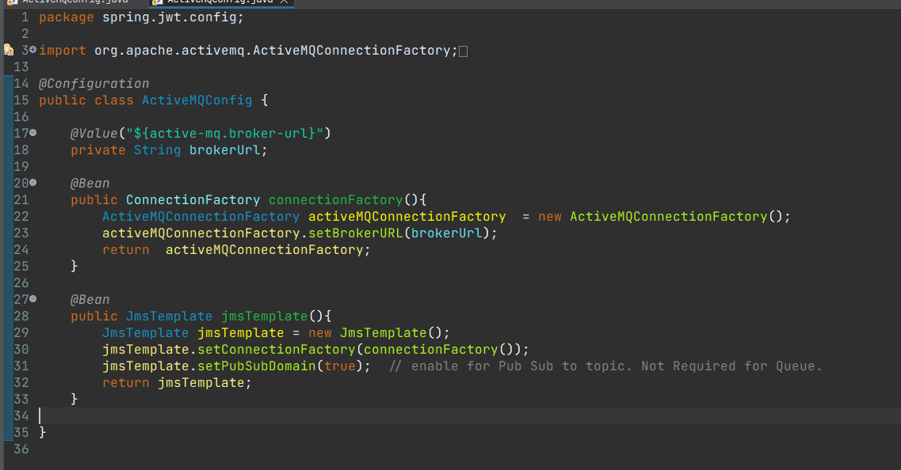
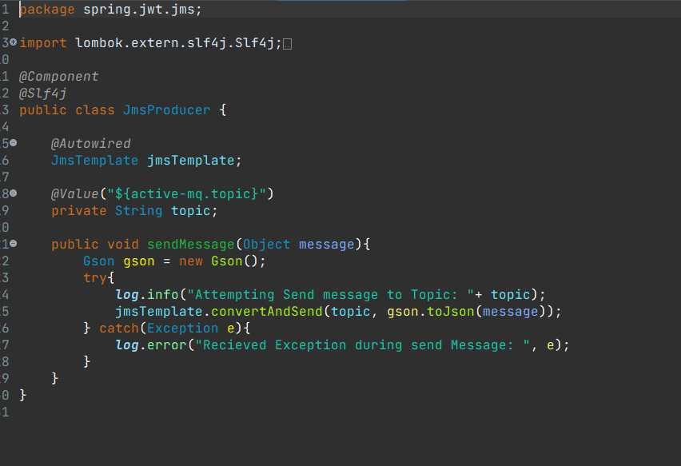
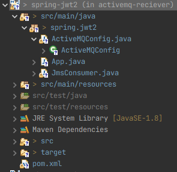
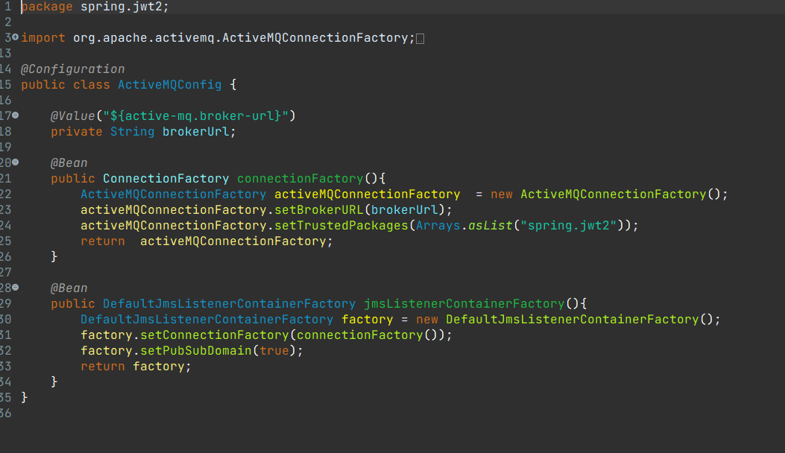
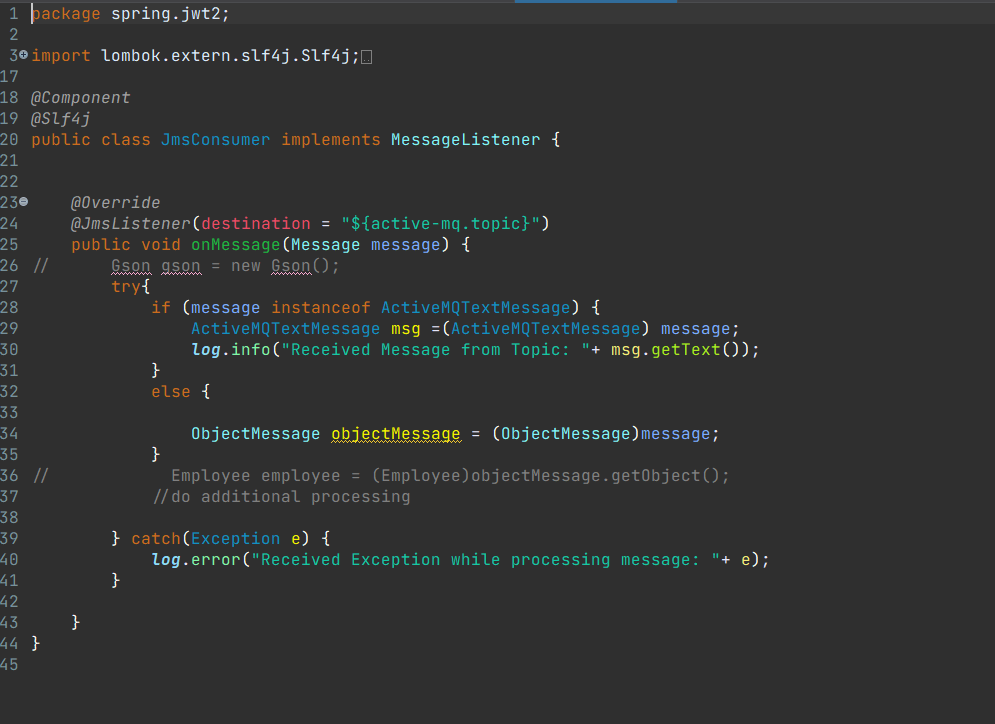

# spring-jwt

# spring-jwt

login:

register:

cau hinh activemq producer:

tao project de nhan message;

cau hinh activemq nhan message

chỉnh host mysql để container kết nối được với mysql ở máy host:
 

build file jar và tạo docker file

 
get dữ liệu từ container

